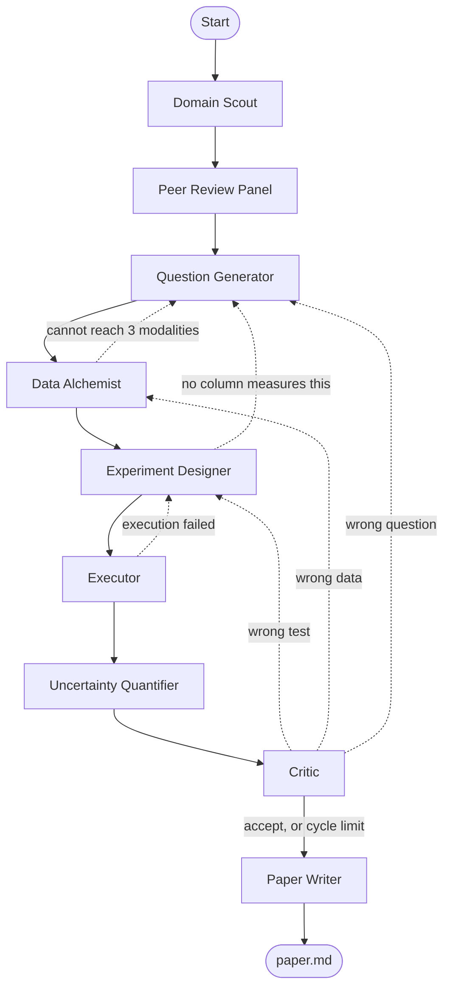
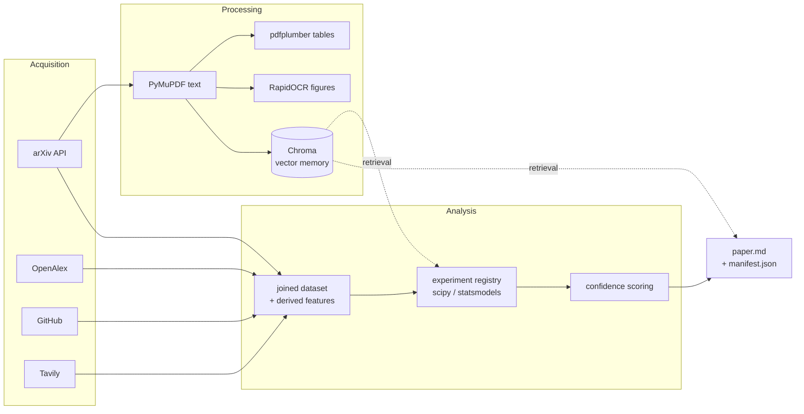

# Autonomous Research Agent

A multi-agent system that, from a single button press and no other input, discovers an
emerging post-2024 scientific domain, formulates a research question that cannot simply be
looked up, gathers and cleans its own data from several disparate sources, runs real
statistical experiments, attacks its own findings, iterates up to five times, and writes a
mini research paper with interactive figures and per-claim confidence scores.

It runs entirely on free-tier infrastructure. A complete run costs **$0.00**.

**▶ Live Demo:** https://autonomous-researcher-production-6d38.up.railway.app

Press *Start Research*. Nothing to type, no sign-in. If the day's free-tier quota is spent,
browse *Runs* — completed papers stay readable.

| | |
|---|---|
| **Scale** | 15,700 lines of Python · 1,950 of TypeScript · 280 tests |
| **Agents** | 9, in a LangGraph state machine with 6 reroute paths |
| **Data** | 5 source modalities, every source SHA-256 hashed |
| **Cost** | $0.00 — Groq and Gemini free tiers, no card |

---

## What makes this more than a prompt chain

Three properties are enforced mechanically rather than requested in a prompt.

**The control flow is a state machine with real cycles.** The Critic returns a structured
verdict naming *where* the work is wrong, and the graph routes accordingly — back to the
experiment, back to the data, or all the way back to the question. The five-cycle cap is
enforced by the router, so no agent can loop by choosing to.

**No model is ever trusted with a number.** Domains are ranked by an Emergence Index computed
from live arXiv, OpenAlex, GitHub and forum measurements. Statistics come from scipy and
statsmodels. The paper's Results section is authored by code, not prose.

**Fabrication is caught, not hoped against.** Every citation must appear in the run's evidence
ledger; every reported figure must match a computed value; every cited URL is re-fetched.
Failures are stripped from the paper and *printed in it*. In one run this caught the model
inventing `arXiv:1805.05238` and two correlation coefficients that were never computed.

---

## Architecture



Solid edges are forward flow. Dashed edges are work being sent backwards — the behaviour that
makes this a graph rather than a pipeline.

### How data moves



Every fetched artefact is content-hashed on arrival, so a reference in the finished paper can
be re-fetched and re-verified.

### The agents

| Agent | Responsibility |
|---|---|
| **Domain Scout** | Samples live arXiv activity and real-time search, asks a model to *name the clusters in that evidence*, then measures each candidate independently. Ranks by a computed Emergence Index. |
| **Peer Review Panel** | Two reviewers score candidates independently, with different prompts and different model families where available. Sharp disagreement triggers a third tiebreak round that sees the disagreement. |
| **Question Generator** | Writes questions requiring ≥2 joined sources, then *searches for each one* — anything a search already answers is rejected as trivial. Rejected questions enter vector memory so rewordings are caught. |
| **Data Alchemist** | Gathers ≥3 distinct modalities (PDF, OCR'd figures, structured API, HTML, tables), derives question-specific features from abstracts, aligns schemas, and records source conflicts rather than resolving them silently. |
| **Experiment Designer** | Pre-registers H₀, H₁ and a prediction *before* execution. Must state which column answers which part of the question, and may declare a question unanswerable rather than substituting. |
| **Executor** | Runs vetted statistical procedures, or model-written code in an AST-restricted sandbox. Feeds failures back for self-repair. |
| **Uncertainty Quantifier** | Scores each claim from four measured signals and **abstains below 60%**. |
| **Critic** | Attacks question drift, confounding, construct validity, selection bias. Statistical checks are arithmetic in Python. Objections must cite a URL that is actually fetched. |
| **Paper Writer** | Assembles the paper with numbers injected from computed results, then verifies its own output against the evidence ledger. |

### How confidence is measured

Asking a model for a confidence score produces a number unrelated to correctness, so
confidence is assembled from four measurable signals:

| Signal | Weight | Source |
|---|---|---|
| Statistical evidence | 40% | p-value, effect size, interval width, n — computed, no model involved |
| Self-consistency | 20% | Same judgement sampled 3× at temperature > 0 |
| Cross-model agreement | 20% | Same judgement put to a different model family |
| Evidence quality | 20% | Independent source count, unresolved conflicts, dataset size |

When no second model family is available its weight is *redistributed*, not defaulted — a
single-provider deployment does not receive confidence it did not earn.

---

## Running it locally

Requires Python 3.11+ and Node 20+.

```bash
git clone <your-repo-url>
cd autonomous-research-agent
```

**1. Backend**

```bash
python -m venv .venv
.venv/Scripts/python -m pip install -r requirements.txt
```

On macOS or Linux use `.venv/bin/python` throughout.

**2. Credentials**

```bash
cp .env.example .env
```

Fill in at least one LLM key. Every service below has a free tier requiring no card:

| Variable | Where | Needed? |
|---|---|---|
| `GROQ_API_KEY` | console.groq.com/keys | Yes — the workhorse |
| `GEMINI_API_KEY` | aistudio.google.com/apikey | Strongly recommended — without a second model family, cross-model agreement is unavailable and confidence is scored on three signals instead of four |
| `TAVILY_API_KEY` | app.tavily.com | Yes — real-time search for domain discovery |
| `GITHUB_TOKEN` | github.com/settings/tokens (classic, **no scopes**) | Optional — lifts 60 req/hr to 5000 |
| `CONTACT_EMAIL` | any real address | Strongly recommended — OpenAlex meters anonymous clients on a small daily budget |

**3. Frontend**

```bash
cd frontend && npm install && npm run build && cd ..
```

**4. Run**

```bash
.venv/Scripts/python -m uvicorn backend.main:app --port 8000
```

Open http://127.0.0.1:8000.

### Headless

The whole system works without a browser — the UI is a view onto a working pipeline, not a
prerequisite for one:

```bash
.venv/Scripts/python -m backend.cli run --cycles 5
```

Artifacts land in `data/artifacts/<run_id>/`: `paper.md`, `manifest.json`, `events.jsonl`, and
each figure as Plotly JSON. Runs also appear in the web gallery.

```bash
.venv/Scripts/python -m backend.cli topology    # print the agent graph as JSON
```

### Tests

```bash
.venv/Scripts/python -m pytest backend/tests -q
.venv/Scripts/python -m ruff check backend/
```

The suite runs fully offline — no network, no LLM calls — so CI needs no credentials.

---

## Deployment

The recommended shape is **backend on Railway, frontend on Vercel**. The same image also runs
as a single container serving both, if you prefer one URL.

### Why split

Free backends sleep. A CDN-hosted frontend loads instantly and shows a "waking the backend…"
state while the API spins up, instead of presenting a reviewer with a dead URL. The frontend
also never sleeps, so the run gallery stays reachable regardless.

### Backend → Railway

Railway's trial grants **$5 of credit for 30 days with no credit card**, which comfortably
covers the seven days of availability this project needs, at full CPU — so vector retrieval
and OCR both stay enabled.

1. railway.app → *New Project* → *Deploy from GitHub repo*.
2. Railway reads `railway.json` and builds the `Dockerfile` automatically.
3. Add your keys under *Variables* (`GROQ_API_KEY`, `GEMINI_API_KEY`, `TAVILY_API_KEY`,
   `CONTACT_EMAIL`, optionally `GITHUB_TOKEN`).
4. Set `CORS_ORIGINS` to your Vercel URL once step two below is done.
5. *Settings → Networking → Generate Domain*.

### Frontend → Vercel

1. vercel.com → *Add New Project* → import the same repo.
2. **Root directory:** `frontend`. Framework preset: Vite.
3. Environment variable: `VITE_API_BASE` = your Railway URL (no trailing slash).
4. Deploy, then put that Vercel URL into Railway's `CORS_ORIGINS`.

### Alternative: Render

`render.yaml` is included as a blueprint. Render's free tier never expires, which makes it the
better long-term home, but it is **512MB / 0.1 vCPU** — a tenth of a CPU cannot run embedding
or OCR inside a sensible time budget. The blueprint therefore sets `ENABLE_VECTOR_MEMORY=false`
and `ENABLE_OCR=false`. Both degrade gracefully: agents read abstracts rather than retrieved
passages, and the Alchemist skips the image modality while still meeting its three-modality
floor. Everything else — all nine agents, the full cycle loop, real statistics, verification —
is unchanged.

### Single container

Leave `CORS_ORIGINS` empty and the backend serves the built frontend itself from one port. The
image reads `$PORT` with a 7860 fallback, so it runs unmodified on Railway, Render, or any host
that expects a fixed 7860.

> **Note on Hugging Face Spaces.** Docker Spaces now require a paid PRO plan; only Static
> Spaces remain free, and those cannot run a Python backend. The frontmatter at the top of this
> file is retained so the repository can still be deployed there by anyone with PRO.

---

## Reproducibility

Every run writes a `manifest.json` recording the seed, model IDs, token usage per provider,
per-tool failure counts, provider failovers, and a **SHA-256 hash of every source fetched**. A
reference in the paper can be re-fetched and re-hashed to confirm the input has not changed.

To check the system is not hardcoding anything, run it three times and compare the discovered
domains — they differ. Grepping the repository for any domain name returns nothing.

---

## Deviations from the suggested stack

The brief invites deviation with justification.

**Railway → Hugging Face Spaces.** Railway removed its free tier in 2023; what remains is a
$5 trial. HF Spaces offers a genuinely free CPU container with no card, sufficient for a
10-minute streaming job.

**Playwright omitted.** A tiered fetcher — direct request, then trafilatura extraction, then a
reader proxy — handles the pages this system encounters, at a fraction of Playwright's ~500MB
image cost. The fetcher's tiers are the fallback Playwright would have been.

**One OpenAI SDK for every provider.** Groq, Gemini, Cerebras and OpenRouter all expose
OpenAI-compatible endpoints, so provider support is a base URL and a model name rather than an
adapter per vendor.

---

## Known limitations

Stated plainly, because a system that reports its own uncertainty should do the same about
itself.

- **Verification proves support, not truth.** The system confirms a claim is supported by the
  data it gathered. A biased sample yields a well-verified wrong conclusion, and the Critic
  raises this as a limitation rather than fixing it.
- **Sample sizes are small** (typically 14–60 papers), so most findings are underpowered — which
  is why claims frequently abstain. That is the honest outcome, not a failure.
- **Table extraction is not validated against the source.** A mis-parsed table produces numbers
  that are wrong but internally consistent.
- **Citation relevance is not checked** — only that the URL was fetched and resolves, not that it
  supports the sentence it is attached to.
- **OpenAlex's free budget is per-IP and daily.** When the Scout exhausts it, citation columns
  are unavailable and the run falls back to arXiv metadata. It says so in the paper.

---

## Layout

```
backend/
  agents/     nine agents, one file each
  analysis/   emergence index, statistics, experiment registry, plots, verification
  graph/      LangGraph assembly, typed state, routing and the cycle cap
  llm/        provider router, per-model budgets, structured-output repair
  memory/     SQLite run ledger, Chroma vector memory
  runtime/    event bus, run orchestration
  schemas/    every inter-agent contract
  tools/      arXiv, OpenAlex, GitHub, search, fetcher, PDF/OCR, sandbox
  tests/      runs fully offline
frontend/src/ React console: agent feed, live graph, results tabs, gallery
```
